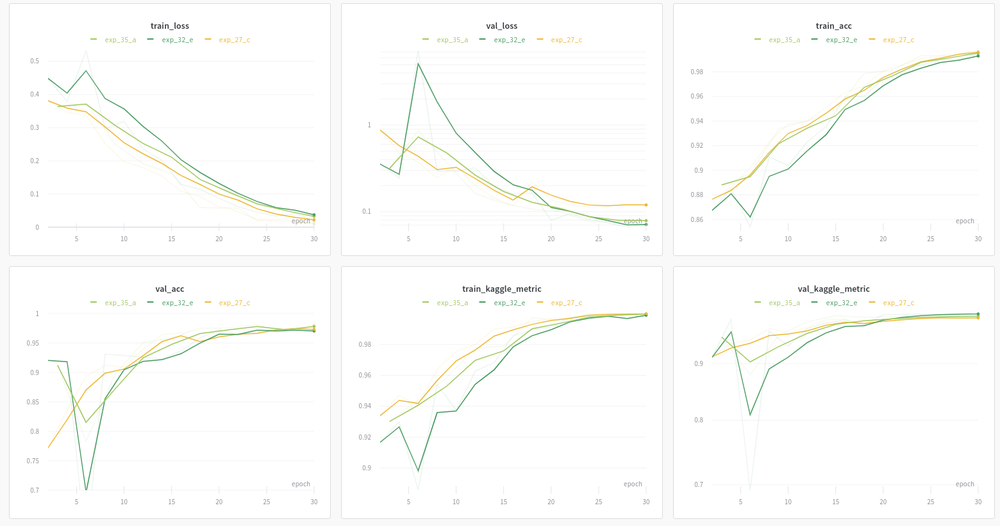
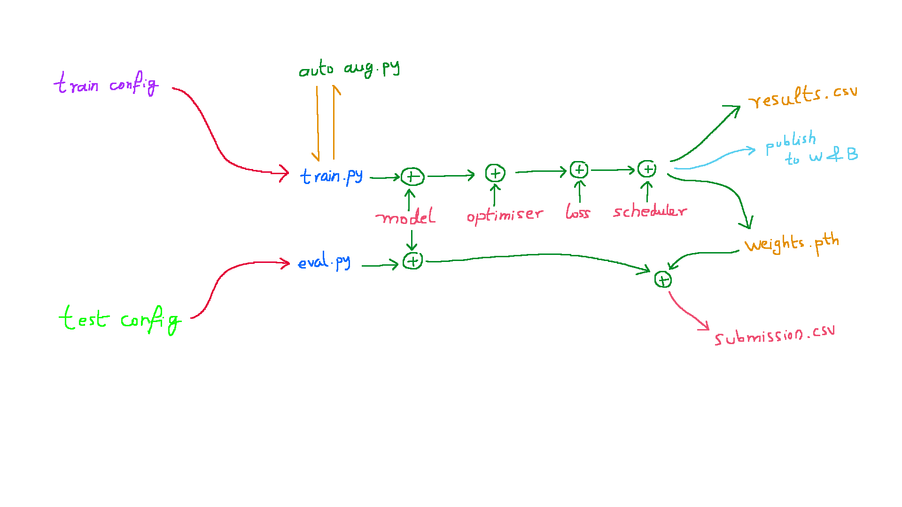

# CVPR 2020 - FGVC ( Plant Pathology )
The objective of this [challenge](https://www.kaggle.com/c/plant-pathology-2020-fgvc7) is to train a model from **images** that can:  
- Classify leaves into diseased / healthy class ( *Mutually exclusive* )
- A leaf may be either of the 4 classes 
    - **healthy** 
    - **multiple_diseases** 
    - **rust**
    - **scab**

| Healthy (0) | Multiple Diseas (1) | Rust (2) | Scab (3) |
| --- | --- | --- | --- |
|   |   |  |  |

## Performance

The [experiments](https://app.wandb.ai/humble_d/plantpatho-2020/table?workspace=user-humble_d) conducted on this dataset have been well catalogued on W&B.
Few [reports](https://app.wandb.ai/humble_d/plantpatho-2020/reports/Plant-Pathology-2020-CVPR--Vmlldzo5OTQ1Mw) that we prepared bases on the best results are also available.

The prominent results are as follows:

A few key points:
- The best model so far was Efficient net b5 (with image resolution of 475x475). This consumed the GPU memory (16GBs) completely. This was the tradeoff we went for.
- We opted for a fixed set of transformations rather than using auto augment.
- TTA improved our results from 0.971 to 0.976.


---
## Pipeline Structure
```
.
|-- auto_aug_utils
|-- config
|-- data
|   `-- fgvc7
|       `-- images
|-- dataset
|-- examples
|-- loss
|-- model
|-- optimiser
|-- results
|-- scheduler
|-- transformer
|-- utils

```



---

## License
This project has been released under the [MIT license](https://github.com/AakashMallik/CVPR2020-FGVC7/blob/master/LICENCE).

## Citing the Pipeline
If you use this project in your research or wish to refer to the baseline results published on W&B, please use the following BibTeX entry.

@misc{cvpr2020-fgvc7,  
  author = {Rajat Modi & Aakash S. Mallik},  
  title = {Pytorch Pipeline v 1.0},  
  howpublished = 
  {  
    \url{https://www.linkedin.com/in/rajat-modi-54377877/}   
    &   
    \url{https://www.linkedin.com/in/aakash-mallik-5b8198132/}  
  },  
  year = {2020}
}

---

## Plans
- [x] Dataloaders 
    - [x] Stratified k fold
- [x] Models
    - [x] Efficientnet B7
    - [x] Efficientnet B5
    - [x] Efficientnet B4
    - [x] Densenet 161
- [x] Loss
    - [x] Cross Entropy Loss
    - [x] Focal loss
    - [x] ArcFace loss
    - [x] Mean ROC AUC loss ( Kaggle )
- [x] Optimizer
    - [x] RMSProp
    - [X] Adam
    - [x] AdamW
- [X] Scheduler
    - [x] [X] CosineAnelingLR with Warmup
    - [X] CosineAnelingLR
    - [X] StepLR

---

## Config File structure

### Training
Sample files ( train_dummy_1, train_dummy_2 ) are provided in the examples directory


```
mode: train
seed: (optional)
validation_frequency: ( optional )
epochs:
batch_size: ( optional )
num_classes: 
train_dataset: 
  name:
  fold: ( optional )
  resize_dims:
  transform: (optional, uses default if not specified)
val_dataset: 
  name:
  fold: ( optional )
  resize_dims:
  transform: (optional, uses default if not specified)
model: 
  name:
  pred_type: regression/classification/mixed
  tuning_type: feature-extraction/fine-tuning
  hyper_params: ( depends on the model )
    key_1:  ( depends on the model )
    key_2:  ( depends on the model )
  pre_trained_path: ( optional key to resume training from another experiment )
  weight_type: ( optional - type of weight - best_val_loss/best_val_kaggle_metric )
               ( will use weights from last epoch if nothing is mentioned )
optimiser: 
  name: 
  hyper_params:
    key_1: ( depends on the optimiser )
    key_2: ( depends on the optimiser )
scheduler:
  name: 
  hyper_params:
    key_1: ( depends on the scheduler )
    key_2: ( depends on the scheduler )
loss_function: 
  name: ( in case of mixed, this will be the regression loss )
  hyper_params:
    classification_loss: ( used in case of mixed prediction )
    classification_coefficient: ( in case of mixed - (0, 1) )
```

### Test
Sample files ( test_dummy ) are provided in the examples directory

```
mode: test
test_dataset: 
  name:
  resize_dims:
  tta: True/False
  transform: (optional, uses default if not specified)
             (A proper transformer is needed in case of TTA)
ensemble: True/False
num_classes:
experiment_list:
  - experiment:
      path: ( valid train config file name )
      weight_type: ( optional - type of weight - best_val_kaggle_metric/best_val_roc )
      resize_dims: ( optional override - original/integer)
      tta: ( optional override )
  - experiment:
      path: ( valid train config file name )
      weight_type: ( optional - type of weight - best_val_kaggle_metric/best_val_roc )
```
***

## How to use the pipeline
#### 1. Using it for train/test
simply modify the run.sh with the required commands:  
```
python main.py "train_dummy_1.yml"
python main.py "test_dummy.yml"
```  
  
#### 2. Using it for augmentation search
Add ```-a``` flag with the training config that you are going to use for scoring:
```
python main.py -a 'train_dummy_1.yml'
```  
  
#### 3. Publish mode while training
Add ```-p``` flag with the training config to publish results to W&B and Telegram:
```
python main.py -p 'train_dummy_1.yml'
```

## Lib dependency
```bash
pip install --user torch seaborn wandb torchvision catalyst albumentations pandas scikit-image tqdm scikit-learn pyyaml blessed pyzmq pretrainedmodels tensorboard transformers
```

## Utility commands
This command will monitor GPU status and keep updating the terminal every 0.5 seconds  
```bash
watch -n0.5 nvidia-smi
```

---

## Taken inspiration from:
- https://github.com/pudae/kaggle-hpa
- https://github.com/wgrathwohl/JEM
- https://www.kaggle.com/akasharidas/plant-pathology-2020-in-pytorch-0-971-score
- https://www.kaggle.com/c/human-protein-atlas-image-classification/discussion/77320
